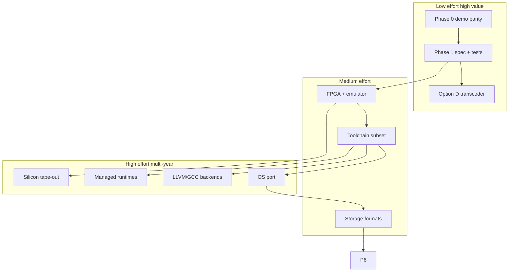
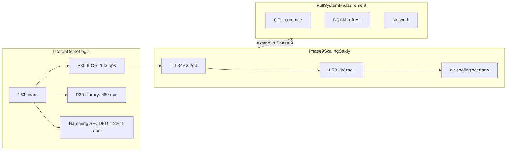
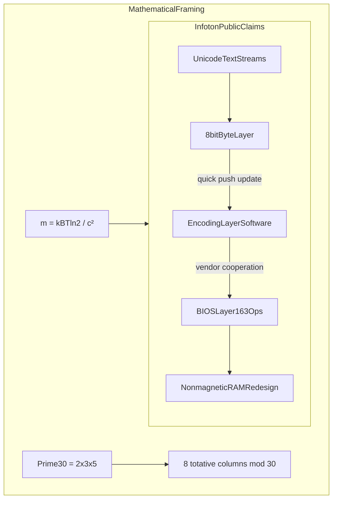
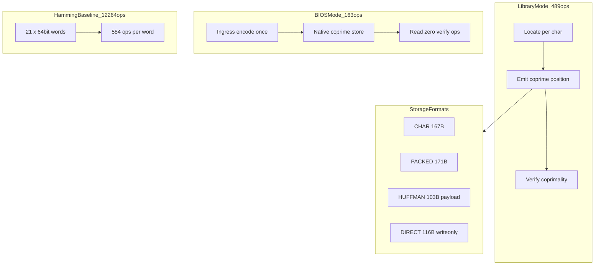
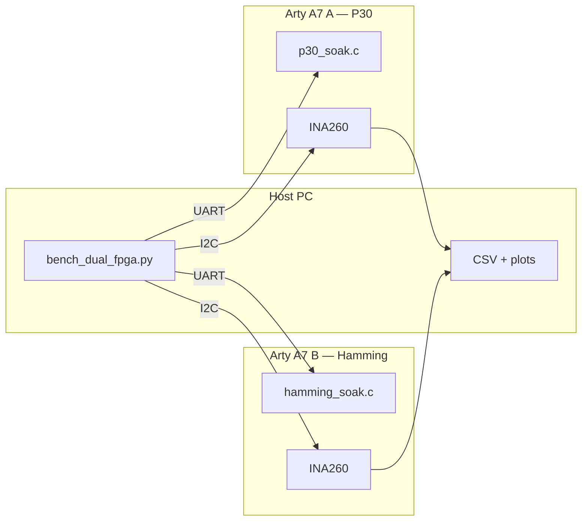

# P30 Full Computer Stack Plan

## Current state

[`c:\projects\p30`](c:\projects\p30) is an **active workspace** (not greenfield):

| Area | Status |
|------|--------|
| Phase 0 audit + ADR-001 | Done — `docs/infoton-source-audit.md`, `docs/adr/001-coprime-position.md` |
| Demo calculator parity | Done — `tools/verify_demo.py`, `crates/p30_calculator`, metrics PASS on canonical corpus |
| Core spec (stub v0.1) | Done — `docs/P30-SPEC.md`, `spec/test-vectors.json`, `crates/p30_core` |
| Open viz | Done — `viz/` (encoder, Hamming, compare, impact); Infoton-matched UI |
| Phase 1 spec + conformance | Done — P30-SPEC v0.2, ADR-002, 102 vectors, `p30inspect`, CI |
| Phase 2 emulator + RTL | **In progress** — `p30emu`, `p30_pack.v`, LiteX + Arty scaffold, soak firmware |
| Phase 2 dev board bitstream | **Not started** — Vivado program on **Digilent Arty A7-35T** |
| Phase 9 dual-FPGA thermal bench | **Emulated** — `soak_emulate.py` + `bench_dual_fpga.py`; hardware run pending |
| Toolchain / OS | Not started — gated on Arty bring-up + soak firmware |

Infoton's public demo is our **starting point**. This repository **implements and extends** it in the open. Gaps in the published materials (bit layout, ISA, silicon) are **research targets**, not blockers for exploration.

---

## Engineering scope and where effort goes

A new encoding touches **every layer** of the stack. Lessons from recent open-ISA projects (RISC-V, LoongArch ports), LLVM backend work, and Linux arch ports:

| Observation | Implication for P30 |
|---------------|---------------------|
| A new ISA requires compiler, debugger, emulator, and linker support — work that **typically takes many people several years** | Prefer **RISC-V soft core + P30 pack/unpack coprocessor** or **encoding-layer transcoder (Option D)** before a standalone P30 ISA |
| Linux ports are often quoted at **~4,000 lines of new arch code** but remain **"a difficult process"** (MM, traps, IRQs, ABI) | Start **xv6-p30** or microkernel; defer full Linux until emulator + toolchain stable |
| Modern CPUs are highly optimized; energy wins depend on workload mix | Phase 9 measures **full systems** alongside op-count models |
| Most experiments extend existing ISAs rather than greenfield ecosystems | **Default strategy:** RISC-V extensions + P30 memory controller + encoding-layer transcoder |

This roadmap is **incremental**: each phase ships a testable artifact. A full native ecosystem is a multi-year exploration; we sequence deliverables so early phases stand alone (transcoder, spec, viz) while later phases pursue silicon and OS.



### Effort concentration by phase

| Phase | Primary effort sink | Order-of-magnitude | Build-on-existing |
|-------|---------------------|--------------------|-------------------|
| **1 Spec** | Bit layout, validity model, UTF interop, test vectors | 1–3 person-months | Infoton demo + OEIS wheel math |
| **2 CPU** | Datapath width, pack/unpack, FPGA bring-up | 6–18 person-months | LiteX / VexRiscv / custom RISC-V |
| **3 Toolchain** | LLVM/GCC backend, ABI, relocations | **2–5 person-years** (full); 3–6 months (asm + monitor only) | Fork RISC-V patterns; stub LLVM first |
| **4 OS** | VM, traps, drivers, syscall ABI | 1–3 person-years (Linux); 3–9 months (xv6) | virtio paravirt; xv6-riscv fork |
| **5 Memory** | Controller pack/unpack, cache lines, P30FS | 6–12 person-months | Byte DIMMs + translation layer |
| **6 Net** | Framing, DMA descriptors, bridges | 4–8 person-months | Ethernet encapsulation; FPGA bridge |
| **7 Apps** | libc, crypto, managed runtimes | Ongoing; runtimes = **years each** | C subset first; MicroPython before JVM |
| **8 Silicon** | P&R unusual widths, MPW, board | 12–24 person-months + NRE | Sky130 MPW before 22 nm |
| **9 Bench** | Full-rack measurement, BER proofs, ROI | Continuous from Phase 2 | Industry rack + power meters |
| **10 Migration** | Emulation, dual-stack, consortium | Ongoing from Phase 1 | Unicode Consortium model |

---

## Infoton source reference (Phase 0 foundation)

Survey of public Infoton P30 artifacts (June 2026). **Bottom line:** the **demo calculator** defines an operation model, storage modes, and a Hamming SECDED baseline — our Phase 0 reproduces it exactly. Bit-level codec, ISA, and silicon are **open design space** we fill in Phases 1–8.

### Public sources

| Source | URL | Technical content found | Role in our work |
|--------|-----|-------------------------|------------------|
| P30 landing page | [infoton.ai/infoton-p30](https://infoton.ai/infoton-p30) | Demo calculator, viz, energy panel | **Primary reference** |
| Data Centers/AI | [infoton.ai/data-centers/ai](https://infoton.ai/data-centers%2Fai) | Landauer framing, rack-power narrative | Phase 9 scaling studies |
| Januarian Physics | [infoton.ai/januarian-physics](https://infoton.ai/januarian-physics) | Zenodo preprints | Background physics |
| Learn | [infoton.ai/learn](https://infoton.ai/learn) | Curated papers (Prime state, entropy) | Bibliography |
| GitHub | [JanuaryNWalker/Infoton](https://github.com/JanuaryNWalker/Infoton) | README + LICENSE | Future upstream if published |
| Zenodo corpus | [zenodo.org — Walker/Infoton](https://zenodo.org/records/18210355) | Januarian Physics preprints | Cross-links to Prime-30 math |

### Infoton demo calculator — decoded operation model (primary source)

User-verified output from the [infoton.ai/infoton-p30](https://infoton.ai/infoton-p30) calculator on a **163-character ASCII sentence** (163 bytes UTF-8 baseline):

#### Two deployment modes

| Mode | Per-character ops | Read path | When to use |
|------|-------------------|-----------|-------------|
| **Library** | **3** (Locate + Emit + Verify) | Re-verify every character; conservative | Transcoder on conventional stack; "runs today" |
| **BIOS-native** | **1** ingress encode; **0** re-verify on read | Value stays coprime through all layers | Full native stack; validity "by construction" |

**Key decode:** `163` is **not a magic constant** — it is **1 op × 163 characters** in BIOS mode. Library mode yields **489 = 163 × 3**. The YouTube [75.2× claim](https://www.youtube.com/watch?v=IxshuWH4LLo) is `12,264 / 163`, comparing BIOS P30 to Hamming baseline.

#### Baseline Infoton compares against

Infoton's `12,264` is **not generic byte processing**. It is explicit **Hamming SECDED** accounting:

```
163 bytes → ceil(163×8 / 64) = 21 sixty-four-bit words
21 words × 584 ops/word = 12,264 ops
```

Library-mode ratio: `12,264 / 489 = 25.1×`. BIOS-mode ratio: `12,264 / 163 = 75.2×`.

Infoton's claim: **coprimality replaces Hamming SECDED** — "3 per character because coprimality is the check" (library); 1 per character at BIOS ingress.

#### Storage formats (Infoton-defined names — must appear in our spec if aligning)

| Format | 163-char sentence | Round-trip? | Notes |
|--------|-------------------|-------------|-------|
| UTF-8 baseline | 163 B | yes | Reference |
| **CHAR** (P30 positions) | 167 B | yes | +4 B; per-character coprime positions |
| **PACKED** | 171 B | yes | Slightly larger at short length |
| **HUFFMAN** total | 533 B | yes | Includes tree overhead |
| **HUFFMAN** payload only | 103 B | no (payload) | Compression on positions |
| **DIRECT** packed | 116 B | write-only | Smallest write path |

Infoton acknowledges: **at short lengths P30 is not about file size** — integrity, not compression. Size advantage claimed only at longer data.

#### Landauer / energy model in demo

- Temperature: **350 K** (77°C, "typical DRAM junction")
- Per irreversible op: **E = kB T ln(2) = 3.349 zJ**
- Memory hierarchy reference (log scale vs Landauer): Berkeley 2016 lab erase ~1.4×; STT-MRAM ~10^7.5×; DRAM+refresh ~10^9.2×
- Demo thesis: **lowest energy = fewer irreversible ops**, not reaching Landauer floor

#### Rack-power extrapolation (demo "Math, Step by Step") — Phase 9 exploration

```
1. Ratio     = 12,264 / 163 = 75.2×
2. P         = N × ops × Eop   (linear in op count)
3. P30 rack  = 130 kW × (163 / 12,264) = 1.73 kW
4. No-water  = 1.73 kW ≤ 30 kW air ceiling → air only
```

**What the demo models:** Scales an assumed **130 kW validation/ECC portion** of a rack by the op ratio. Phase 9 extends this to **GPU compute, memory refresh, networking, and cooling** — the demo itself notes total facility power includes more than validation.

**Phase 9 open questions:**

1. Map abstract ops (3/char vs 584/word) to **silicon gate counts** and measured joules
2. Measure **validation share** of rack power on real AI hardware
3. Compare **Library (489)** vs **BIOS (163)** deployment paths on mixed vs native stacks
4. Characterize **coprimality + PACKED** vs Hamming SECDED on identical BER models
5. Validate **Landauer scaling** against DRAM and ALU measurements at 350 K reference



### Infoton's stated architecture (inferred from public materials + calculator)



**Deployment layers Infoton describes (deepest = claimed best):**

1. **Encoding layer** — software transcoder; "quick push" update; still high op count in demo
2. **BIOS layer** — **1 irreversible op per character** at ingress; **0 ops on read** (coprime position preserved natively)
3. **Library layer** — **3 ops per character** (Locate + Emit + Verify); runs on conventional stack today
3. **Hardware/RAM layer** — "nonmagnetic RAM," no rare earths, already shipping (no product named)
4. **Industry coalition** — compares to 1993 Unicode-style multi-vendor encoding adoption (IBM, Microsoft, Apple, etc.)

**What Infoton still does *not* define publicly:**

- **Bit layout** for a "P30 position" — how Locate maps a character/scalar to a coprime integer
- **Algorithm** for Emit and Verify (only names and op counts)
- **PACKED / HUFFMAN / DIRECT** on-wire byte formats
- **584 ops/word** Hamming breakdown (assumed correct for reproduction; must rederive or obtain)
- Patent number, encoder source code, API (LinkedIn mentions future "API for machine guessing algorithms")
- Whether **Hsiao (72,64)** from your bibliography is used internally or Hamming SECDED is the only published baseline

### Design questions we're exploring

**1. Landauer, mass, and information physics**

Infoton's [Data Centers/AI](https://infoton.ai/data-centers%2Fai) page connects `kBTln(2)` to mass via `E=mc²`. We treat this as **theoretical framing**; Phase 9 measures **switching energy** on real hardware alongside the demo's per-op Landauer floor.

**2. Radix, entropy, and the prime-30 wheel**

The wheel excludes 22/30 integers — structural redundancy that enables **validity by construction**. How this maps to **Shannon limits** and **storage size** at short vs long messages is an active spec question (demo: integrity first at 163 chars).

**3. Eight totatives vs 30-bit machine words**

The Prime 30 wheel has **8 totatives** `{1,7,11,13,17,19,23,29}` per block ([OEIS A098591](https://oeis.org/A098591)). Infoton's "8 columns" align with **8-ary wheel structure**. Our Phase 2 **30-bit code unit** (10 × 3-bit totative indices) is a **design choice** for silicon — worth prototyping on FPGA.

**4. From abstract ops to silicon**

The demo defines:

- **P30 Library:** 3 irreversible ops/char (Locate, Emit, Verify)
- **P30 BIOS:** 1 op/char ingress; 0 on read
- **Hamming SECDED baseline:** 584 ops per 64-bit word

Phase 0 **reproduces these counts**. Phase 9 maps them to **gate counts, joules, and wall-clock** on emulator and silicon.

**CCP-0 (Computation Count Protocol — from Infoton demo):**

| Counter | Library | BIOS | Hamming baseline |
|---------|---------|------|------------------|
| Locate | 1/char | 0 (folded into ingress) | — |
| Emit | 1/char | 1/char (ingress) | — |
| Verify | 1/char | 0 on read | — |
| SECDED | — | — | 584/64-bit word |
| Landauer E | kB×350×ln(2) per irreversible op | same | same |

**5. System-level energy and cooling**

The demo's 75.2× op ratio is **exact** given its definitions. Phase 9 explores how that ratio propagates to **rack power, PUE, and cooling** when validation, compute, memory, and I/O are measured together.

**6. Integrity models — coprimality, Hamming, Hsiao**

Infoton positions coprimality as the check. We explore:

- **Detection rate** vs bit-flip models (BER)
- **Combined models:** coprime positions + PACKED checksum + Hamming/Hsiao baselines
- **Library vs BIOS** read paths on mixed and native stacks

**7. IP and collaboration**

Infoton references patented technology. Our open stack proceeds independently; **collaboration** (encoder source, patent clarity) would accelerate bit-exact parity.

### Decision gate: native code unit (Phase 0)

| Option | Unit | Basis in Infoton demo | Pros | Cons |
|--------|------|----------------------|------|------|
| **E — Coprime position (CHAR)** | **Per-scalar P30 position** + storage modes | **Demo primary artifact** — "P30 positions (CHAR)" | Aligns with Infoton calculator; 167 B ≈ UTF-8 at short length | Position bit-width unspecified; not a fixed ISA word |
| **A — Wheel byte** | **8 bits** (8 totative flags) | OEIS A098591; "8 columns" narrative | Known math | Not what demo storage sizes suggest |
| **B — Totative trit word** | **30 bits** (10 × 3-bit indices) | Extrapolation for full silicon stack | Clean ISA for Phase 2–8 roadmap | **Not in Infoton demo** |
| **D — Library transcoder first** | UTF-8 + P30 CHAR/PACKED | Library mode (489 ops); "runs today" | Matches Infoton deployment path | Not BIOS-native; full stack deferred |

**Recommendation (Phase 0 complete):**

1. **Phase 0–1: Option E + D** — CHAR/PACKED/HUFFMAN/DIRECT transcoder; demo op counts and byte sizes on canonical corpus ✓
2. **Phase 2+: evaluate Option B** — 30-bit machine words if BIOS-native path requires fixed types
3. **Phase 9: characterize** rack-power and cooling scenarios with full-system measurements
4. **Benchmark both** Hamming (demo baseline) and Hsiao (DRAM industry) in `benches/`

### Validity model (aligned to Infoton demo)

Infoton's demo positions **coprimality as a replacement for Hamming SECDED**, not as a supplement to Hsiao DRAM ECC. Our stack supports both views:

1. **Semantic (coprime position):** Each character/scalar → **P30 position** (coprime by construction). **Locate** finds position; **Emit** writes it; **Verify** checks coprimality (library mode only).
2. **Storage (Infoton formats):** CHAR / PACKED / HUFFMAN / DIRECT — normative in Phase 1 if aligning to demo
3. **Physical (benchmark baselines):** Hamming SECDED (584 ops/word) and Hsiao SEC-DED as **comparators** in `benches/` — explore combined models with coprimality + PACKED
4. **BIOS-native invariant:** Once encoded, position persists; reads skip Verify — requires native P30 memory path (Phase 2+)



**Why not pure coprimality on raw 30-bit integers?** Only ~26.7% of integers are coprime to 30 ([totatives of 30](https://oeis.org/A005867)). Infoton's "73.3% excluded" refers to the **integer line**, not a free-energy lunch—payload must still be encoded into the valid subset.

**Why not Hsiao-only?** Loses Prime 30 semantic identity; indistinguishable from standard ECC RAM.

**Why not Infoton's physics layer in the spec?** Januarian Physics preprints ([Zenodo 18210355](https://zenodo.org/records/18210355)) are orthogonal to codec design. Keep physics citations in `docs/background/`; keep `P30-SPEC.md` strictly implementable.

---

## Target repository layout

```
p30/
  docs/
    infoton-source-audit.md     # Phase 0: critical source review (this section expanded)
    validity-model-analysis.md  # Options A–D + decision record
    P30-SPEC.md                 # normative spec (Phase 1, after gate)
    isa/P30-ISA-v0.1.md         # Phase 2
    migration.md                # Phase 10
  spec/
    p30-unit.cddl               # machine-readable 30-bit unit schema
    test-vectors.json           # golden vectors
  crates/p30_core/              # reference library (Rust)
  crates/p30_calculator/        # CLI metrics
  tests/conformance/            # pytest/cargo test/CTest
  tools/
    p30inspect/                 # validate, stats, transcode
    p30-calculator/             # reproduce Infoton demo op counts + storage sizes
  emulator/p30emu/              # Phase 2: cycle-accurate soft core
  fpga/                         # Phase 2: LiteX/nMigen or Verilog
  toolchain/                    # Phase 3: asm, linker scripts, LLVM backend stub
  os/                           # Phase 4+
  benches/                      # Phase 9
  LICENSE, README.md
```

Language choice for reference impl: **Rust** (memory safety, good for spec conformance tests) with a **C ABI** header for toolchain/OS integration later.

---

## Phase 0 — Infoton source audit and unit-width gate (execute before normative spec)

**Goal:** Document what Infoton actually publishes vs what we must invent; freeze native unit width.

### Deliverables

- [`docs/infoton-source-audit.md`](docs/infoton-source-audit.md) — includes demo calculator decode (this section)
- [`docs/validity-model-analysis.md`](docs/validity-model-analysis.md) — Options A/B/D/E + Hamming vs Hsiao comparator rationale
- **CCP-0 implementation:** [`tools/p30-calculator/`](tools/p30-calculator/) — must output Library 489, BIOS 163, Hamming 12264 on canonical 163-char sentence
- **Canonical test corpus:** exact 163-char sentence from Infoton demo (capture from calculator or video transcript)
- **Decision record:** ADR-001 — Option E (coprime position) for Phase 1; Option B deferred to Phase 2 gate

### Exit criteria (hard gate — do not start Phase 1 spec without these)

- [ ] `p30-calculator` reproduces Infoton byte sizes (CHAR 167, PACKED 171, etc.) within ±0 bytes or documents delta
- [ ] `p30-calculator` reproduces op counts (489 / 163 / 12264) on canonical corpus
- [ ] ADR-001 merges: Option E + D for Phase 1

---

## Phase 1 — Core specification (after Phase 0 gate)

**Goal:** Public spec + reference test suite. **Without clear data-layout rules, a compiler cannot generate correct code** — this phase is the foundation for everything downstream.

### 1. Define the code unit

Precisely describe the P30 code unit's bit layout, how words are formed (30 / 60 / 120-bit compositions), which patterns are valid/invalid, how **intrinsic validity** (coprimality) is computed, and how to **detect corruption** (Verify, PACKED checksum, comparator baselines).

Document in [`docs/P30-SPEC.md`](docs/P30-SPEC.md) **per ADR-001 (Option E)**:

- **P30 position:** coprime integer per scalar; **Locate**, **Emit**, **Verify**
- **Storage formats:** CHAR, PACKED, HUFFMAN, DIRECT with round-trip semantics per demo
- **Library vs BIOS profiles:** CCP-0 op counting
- **Optional Phase 2 appendix:** 30-bit fixed word (Option B) — only if BIOS-native silicon requires it; **not stated by Infoton**

### 2. Lay out memory

| Topic | Decision (draft) | Why it matters |
|-------|------------------|----------------|
| Endianness | Little-totative-first within unit; little-unit-first in multi-unit words | Compiler struct layout |
| Alignment | 1/2/4/8/32 **units** (30/60/120/240/960 bits) | ABI and cache line design |
| Bus fit | **4×30 = 120 bits → 15 bytes** (MSB padding in byte 15 nibble) on 8-bit media | Existing DRAM/NIC without custom lanes |
| Reserved patterns | All-0x7 = **PAD**; all-0x0 = **INVALID** (never emitted) | Decoder safety |
| Network | **P30TP** header: magic, unit count, Hsiao block CRC, version | Phase 6 framing prep |

### 3. Interoperability layer

Design how P30 payloads map to/from **UTF-8 / UTF-16** so mixed systems coexist during migration:

- **P30-UTF8-TRANS:** lossless for valid Unicode scalars via CHAR mode minimum
- **Encode:** UTF-8 → wheel codec → P30 stream (optional BOM `P30\x00`)
- **Decode:** invalid units → U+FFFD + conformance error flag
- **Normalization:** NFC on decode by default (document NFD option)
- **Dual-stack period:** transcoder runs on conventional stack (Library 489 ops); native BIOS path deferred

### Deliverables

- [`docs/P30-SPEC.md`](docs/P30-SPEC.md) — normative public specification
- [`spec/test-vectors.json`](spec/test-vectors.json) — reference suite: encoding/decoding, validity checking, UTF round-trip, BER inject
- [`crates/p30_core/`](crates/p30_core/) — reference library: encode, decode, validate, transcode_utf8, Hamming/Hsiao comparators
- [`tools/p30inspect`](tools/p30inspect) — CLI: validate, stats, transcode
- CI: conformance on every push

### Exit criteria

- [ ] ≥100 golden vectors pass
- [ ] Demo parity maintained (489 / 163 / 12264 ops; CHAR/PACKED sizes)
- [ ] ADR-001 bit-layout gaps documented explicitly (not hand-waved)

---

## Phase 2 — Processor architecture

**Goal:** FPGA-hosted core that can **load, save, and validate** P30 data and execute simple programs.

**Real-world practice:** Prototype on FPGA before silicon. Adapt an existing **RISC-V soft core** (LiteX, VexRiscv) to operate on 30-bit units via **hardware pack/unpack** — validates arithmetic, load/store, and I/O without committing to tape-out.

### Reference FPGA board (recommended)

**Primary target: [Digilent Arty A7-35T](https://digilent.com/shop/arty-a7-35t-fpga-development-board/)** (Xilinx **XC7A35T-1CSG324C**). Order **two identical units** for the Phase 9 A/B thermal experiment.

| Criterion | Why Arty A7-35T |
|-----------|------------------|
| LiteX support | First-class in `litex-boards` (`digilent_arty`) |
| Cost | ~\$129 USD each → ~\$260 for a matched pair + sensors |
| Matched A/B | Same part, same PCB, same power path — minimizes confounders |
| I/O | USB-UART (monitor), USB-JTAG, PMOD for **INA260** power sensor |
| Power measurement | Barrel/USB 5 V input easy to instrument; static + dynamic in measurable range |
| On-die temp | Xilinx **XADC** accessible for optional junction-adjacent readings |
| Headroom | Enough LUT/BRAM for VexRiscv **lite** + P30 pack/unpack + soak loops |

**Alternate (more headroom, same toolchain):** Arty A7-**100T** if 35T closes timing with full SoC.

**Defer for first thermal bench:** AMD Kria KV260 / Zynq — higher power, heterogeneous PS adds variables, overkill until Arty loops are proven.

**Bench BOM (per pair of boards):**

| Item | Qty | Role |
|------|-----|------|
| Digilent Arty A7-35T | 2 | Matched P30 vs Hamming targets |
| Adafruit INA260 (or INA219 + shunt) | 2 | Log **input power (W)** per board over I²C |
| USB hub + host PC | 1 | UART soak orchestration + data logging |
| Optional K-type thermocouple + amplifier | 2 | Heatsink skin temp (secondary to power) |
| Fixed fan + spacer jig | 1 | Matched airflow across both boards |

### Architecture decisions (recommended defaults)

| Decision | Choice | Rationale |
|----------|--------|-----------|
| Register width | **120 bits** (4 units) | Aligns with 960-bit cache blocks; SIMD migration path |
| Address unit | **30 bits** | Native pointer size |
| ISA base | **RISC-V subset + P30 coprocessor** | Reduces monumental greenfield ISA effort |
| Memory | Byte-backed **pack/unpack** in controller | Avoids custom DIMMs in prototype |

### Work items

- [x] Draft [`docs/isa/P30-ISA-v0.1.md`](docs/isa/P30-ISA-v0.1.md): opcodes, monitor commands, MMIO map
- [x] [`emulator/p30emu`](emulator/p30emu): functional monitor REPL (`LOAD` / `SAVE` / `VALIDATE`)
- [x] [`fpga/p30_pack.v`](fpga/p30_pack.v): golden-tested 15-byte lane pack/unpack
- [x] [`fpga/litex/`](fpga/litex/): SoC scaffold (sim platform)
- [x] **Arty A7 platform** in `fpga/litex/p30_soc.py` (`--platform arty`) + `p30_arty.py`
- [x] [`fpga/monitor_rom/p30_soak.c`](fpga/monitor_rom/p30_soak.c) + [`hamming_soak.c`](fpga/monitor_rom/hamming_soak.c) + `corpus_data.c`
- [x] [`tools/bench_dual_fpga.py`](tools/bench_dual_fpga.py) — host orchestrator (UART + INA260)
- [x] [`tools/soak_emulate.py`](tools/soak_emulate.py) + [`soak_core.py`](tools/soak_core.py) — **host emulation** (no boards)
- [ ] Arty **bitstream build + flash** (Vivado) and hardware soak ≥1 h
- Validate on **emulator and Arty A7**

### Deliverable

Monitor on emulator **and** Arty A7 reads/writes P30 files from host and runs a minimal validation loop; **soak firmware** ready for Phase 9 dual-board run.


---

## Phase 3 — Tool-chain

**Goal:** **"Hello, world"** cross-compiled on host, runs on P30 emulator/FPGA.

**Where most toolchain effort goes:** Compiler back-ends (LLVM/GCC) — pointer width, struct layout, calling conventions, relocation types. Full support is **years of work**; many projects use **non-standard extensions on an existing ISA** to reduce scope.

### Work items

| Component | Scope | Priority |
|-----------|-------|----------|
| **Assembler / linker** | New opcodes, `R_P30_*` relocations, `p30-elf` | P0 — needed for any native code |
| **Compiler** | LLVM backend stub → C subset; no float initially | P1 — stub first, full backend later |
| **ABI** | `p30-call-v0`: 8 arg units in regs; 30-bit pointers; 2-unit stack align | P0 |
| **Runtime** | newlib/libc: heap/stack, `_write` → UART, syscalls | P1 |

### Deliverable

`p30-elf-gcc -O0 hello.c && p30-emu hello.elf` prints `Hello, P30\n`

### Exit criteria

- [ ] Asm + linker sufficient for monitor and kernel bring-up
- [ ] LLVM stub accepts `-march=p30` (even if codegen is minimal)
- [ ] Document explicit **defer list** (C++, float, exceptions) to avoid scope creep

---

## Phase 4 — Operating system

**Goal:** Bootable kernel on P30 core that **drops into a shell**.

**Real-world practice:** OS porting is **often underestimated**. Even a minimal Linux arch port (~4k LOC) requires deep knowledge of **context switching, traps, scheduling, virtual memory**, and interrupt dispatch. Use **paravirtual devices (virtio)** initially to avoid rewriting every driver.

### Paths

| Path | Base | Horizon | Deliverable |
|------|------|---------|-------------|
| **A (recommended)** | xv6-riscv → **xv6-p30** | 3–9 months | Shell + `p30inspect` in initramfs |
| **B (production)** | Linux `arch/p30/` fork | 1–3+ years | Full POSIX ecosystem |

### Work items

- Kernel: context switch, traps, scheduler, VM in 30-bit mode
- **virtio** console, block, net over MMIO
- **Syscall ABI** mapped to Phase 3 calling convention
- Drivers: only virtio in v1; no native NVMe/Ethernet ASIC

### Deliverable

Shell on emulator/FPGA; run conformance tools from initramfs.

---

## Phase 5 — Memory and storage

**Goal:** Usable **database or key-value store** running natively on P30 (SQLite milestone).

### Work items

| Area | v1 approach | Open question |
|------|-------------|---------------|
| **DRAM** | Byte DIMMs + controller **pack/unpack** (15 bytes ↔ 4 units) | Custom 30-bit lanes deferred to silicon |
| **Cache** | 960-bit lines (= 32 units); validity metadata travels with data | Tag format vs Hsiao shortcut bit |
| **Persistent formats** | **P30FS v0:** 4 KiB blocks, header + Hsiao; SQLite page = 4096 | Translation layer for legacy FS optional |

### Deliverable

SQLite `SELECT 1` integration test passing on emulator.

---

## Phase 6 — Interconnect and networking

**Goal:** **Two P30 nodes** exchanging packets over **bridged Ethernet**.

### Work items

- **Framing:** P30TP over dedicated ethertype or UDP; error detection aligned with Phase 1 validity model
- **NIC firmware / DMA:** Descriptors in 120-bit multiples; kernel driver (Phase 4)
- **Bridges:** FPGA/ASIC bridge translates P30 ↔ legacy 8-bit frames during migration

### Deliverable

Two emulator instances exchange 1 MiB P30 blob; `sha256` match both sides.

---

## Phase 7 — Application and language ecosystem

**Goal:** **Web service** running natively on P30 that speaks **JSON/REST** to a standard browser.

**Effort note:** Managed runtimes (JVM, .NET, Python) each require **stable C toolchain + POSIX subset** — schedule **MicroPython first**, defer JVM/.NET.

### Work items

- **Stdlib:** I/O, crypto (ChaCha20 on 120-bit blocks), data structures on 30-bit units
- **Translators / shims:** JSON, logs, databases ↔ P30 transcoding tools
- **p30-httpd:** GET `/api/status` returns JSON externally; internal storage native P30

### Deliverable

REST endpoint reachable from conventional browser; payload integrity verifiable via P30 path.

---

## Phase 8 — Silicon tape-out

**Goal:** **Evaluation boards** for developers.

### Work items

- **Floor-plan / timing:** Place-and-route for unusual datapath widths; clock, power, thermal budgets
- **First silicon:** MPW at **Sky130 / GF180** before 22 nm; measure area, power, performance
- **Board:** VRMs, DDR4 (byte mode), UART, PCIe bridge; cooling plan

### Deliverable

Lab board running same monitor ROM as FPGA (target ≥ FPGA clock / 10).

---

## Phase 9 — Benchmarking and impact quantification

**Goal:** Characterize the stack — op counts, silicon energy, integrity, and system-level behavior. Findings inform spec, deployment path, and Phase 8 silicon priorities.

| Metric | Method |
|--------|--------|
| **CCP-0 op count** | Match demo: 489 / 163 / 12264 on canonical corpus |
| **Per-operation energy** | pJ/op: 30-bit ALU, caches, DRAM vs 32/64-bit @ same node |
| **Integrity equivalence** | BER sweep: coprimality Verify vs Hamming vs Hsiao |
| **Dual-FPGA thermal (early)** | Two **Arty A7-35T** boards — see below |
| **System PUE** | Realistic workloads (nginx + inference), not validation-only |
| **ROI** | Engineering + capital cost vs **measured** savings |

**Outcomes:** Document where P30 wins (transcoder, memory controller, full native stack, or combinations). All results publish openly — they refine scope and investment, whether the advantage is large or incremental.

### Dual-FPGA thermal experiment (Phase 2/9 bridge)

**Purpose:** Move from the demo’s op-count ratio (Library **489** vs Hamming **12 264** on the 163-char corpus) to **measured input power (W)** on identical silicon — without claiming the `viz/impact.html` rack columns (130 kW vs 1.73 kW) on dev boards.

**Hypothesis:** At matched clock, iteration rate, and ambient conditions, the P30 soak loop draws **less steady-state power** than the Hamming soak loop on the same corpus. Op-ratio (**~25×** Library vs Hamming, **~75×** BIOS vs Hamming) is an upper-bound **shape**, not a guaranteed FPGA heat ratio (static power and memory traffic compress the gap).

#### Setup

| Board | Bitstream | Firmware loop | Demo analogue |
|-------|-----------|---------------|---------------|
| **A** | `p30_soc` | Load canonical corpus → Locate/Emit/Verify (Library) or BIOS ingress | 489 or 163 ops/pass |
| **B** | `p30_soc` | Same corpus → Hamming SECDED (584 × 21 words) | 12 264 ops/pass |

Both boards: **Digilent Arty A7-35T**, same LiteX clock constraint, minimal UART (no printf in hot loop), corpus in BRAM.

#### Protocol

1. **Burn-in** — 30 min per board at fixed workload before recording  
2. **Soak** — ≥1 h steady-state log of INA260 **input power**, host iteration counter, optional XADC  
3. **Swap A/B** — repeat with boards physically swapped (cancel placement/airflow bias)  
4. **Report** — mean ± stdev **W**, **J/pass** (if pass timing trusted), **ΔT** above ambient (secondary)  
5. **Environment** — log room temp; fixed fan distance or open-air with documented airflow  

#### Repo deliverables

| Path | Role |
|------|------|
| [`docs/bench/dual-fpga-thermal.md`](docs/bench/dual-fpga-thermal.md) | Bench protocol + BOM + **emulation** section |
| [`fpga/monitor_rom/p30_soak.c`](fpga/monitor_rom/p30_soak.c) | P30 hot loop |
| [`fpga/monitor_rom/hamming_soak.c`](fpga/monitor_rom/hamming_soak.c) | Hamming hot loop |
| [`tools/bench_dual_fpga.py`](tools/bench_dual_fpga.py) | Dual-UART + I²C power logger (hardware) |
| [`tools/soak_emulate.py`](tools/soak_emulate.py) | Host dual-board emulation + CSV (`benches/thermal/emulate_*.csv`) |
| [`tools/soak_core.py`](tools/soak_core.py) | Python mirror of soak firmware op loops |
| [`tools/verify_soak_bench.py`](tools/verify_soak_bench.py) | CI: corpus gen + soak_emulate smoke |
| [`benches/thermal/`](benches/thermal/) | Raw CSV runs (gitignored `*.csv`) |

#### Host emulation (no hardware)

```bash
python tools/soak_emulate.py --mode max
python tools/soak_emulate.py --mode rate --rate 1 --duration 10
python tools/thermal_report.py benches/thermal/emulate_rate_*.csv
```

See [`docs/bench/thermal-claim-chain.md`](docs/bench/thermal-claim-chain.md) for the full publishable chain (steps 1–7).

#### What we will **not** claim from this bench alone

- Rack-scale kW or water-cooling necessity (facility extrapolation stays separate)  
- Landauer floor proximity (FPGA switching energy ≫ kT ln 2 at 350 K)  
- A specific **75×** heat ratio unless measured and reproduced with error bars  



---

## Phase 10 — Migration and coexistence

**Goal:** Long-term path for mixed P30 / UTF-8 systems without big-bang cutover.

### Work items

- **Emulation / virtualization:** QEMU `p30-softmmu`; legacy binaries in compatibility layer where feasible
- **Dual-stack period:** VFS `p30fs,transcode=utf8`; HTTP `Accept` negotiation; clear deprecation schedule in [`docs/migration.md`](docs/migration.md)
- **Standards consortium:** Open group (Unicode Consortium model) for spec semver, compliance tests, IP collaboration

### Deliverable

Published migration guide + consortium charter draft; Phase A (transcoder), Phase B (native apps), Phase C (default-on) timeline.

---

## Implementation timeline (indicative — assumes small core team)

| Phase | Duration | Person-effort | Depends on |
|-------|----------|---------------|------------|
| **0 Audit + ADR-001** | 2–3 weeks | ~1 person-month | — |
| **1 Spec + tests** | 6–10 weeks | 2–4 person-months | Phase 0 gate |
| **2 Emulator + FPGA** | 3–5 months | 6–12 person-months | Phase 1 frozen |
| **3 Toolchain (minimal)** | 3–6 months | 6–12 person-months | Phase 2 emulator |
| **3 Toolchain (LLVM full)** | +2–4 years | **Many person-years** | Optional parallel track |
| **4 OS (xv6)** | 3–9 months | 4–8 person-months | Phase 3 minimal |
| **4 OS (Linux)** | +1–3 years | Team | Optional parallel track |
| **5 Storage** | 2–4 months | 3–6 person-months | Phase 4 |
| **6 Networking** | 2–3 months | 2–4 person-months | Phase 4–5 |
| **7 Apps** | ongoing | runtimes = years each | Phase 3–6 |
| **8 Silicon MPW** | 12–18 months | 12–24 person-months + NRE | Phase 2 stable |
| **9 Benchmarks** | continuous | from Phase 2 | Hardware available |
| **10 Migration** | continuous | from Phase 1 | Spec stable |

**Full stack to eval silicon + OS + REST:** roughly **5–15 person-years** for a focused team — an exploration worth pursuing in phases.

---

## Open questions and mitigations

| Topic | Priority | Next step |
|-------|----------|-----------|
| **Bit layout not in public demo** | High | Reverse from CHAR 167 B; Tier-1 alphabet from viz; collaborate with Infoton if source opens |
| **Coprimality + SECDED models** | High | BER benchmarks; PACKED checksum in open spec |
| **Rack-power scaling** | Medium | Phase 9 dual-FPGA bench first; facility measurements later |
| **Dual-FPGA thermal bench** | High | **Done (emulated):** `soak_emulate.py`; procure 2× Arty + INA260 for hardware |
| **Toolchain scope** | High | Minimal asm/linker first; RISC-V + coprocessor; LLVM parallel track |
| **OS bring-up** | Medium | xv6-p30 + virtio; Linux when ABI stable |
| **Energy at system level** | Medium | Phase 9: op counts + silicon + PUE together |
| **IP / collaboration** | Medium | Open spec proceeds; outreach to Infoton welcome |
| **Reference encoder** | Medium | Build our own; compare as Infoton publishes |
| **Benchmark outcomes** | Low | Publish all results; let data guide Phase 8–10 investment |

---

## Phase 0–2 status (current)

Phase 0 and Phase 1 are **done**. Phase 2 scaffold is **in progress**:

1. [x] **Tier-1 alphabet parity** — `crates/p30_core/src/tier1.rs` + `spec/tier1_alphabet.json`
2. [x] **`p30inspect` CLI** + GitHub Actions conformance CI
3. [x] **Expand test vectors** to ≥100 — `spec/conformance_vectors.json`
4. [x] **Freeze bit layout** in P30-SPEC v0.2 + ADR-002
5. [x] **p30emu** + P30-ISA v0.1 + `p30_pack.v` + LiteX/Arty scaffold
6. [x] **P30/Hamming soak firmware** + `bench_dual_fpga.py` + **`soak_emulate.py`**
7. [ ] **Arty A7-35T bitstream** flashed on **two** boards + INA260 hardware soak

**Next gate for hardware thermal run:** item 7 — Vivado bitstream on two Arty A7-35T boards.
