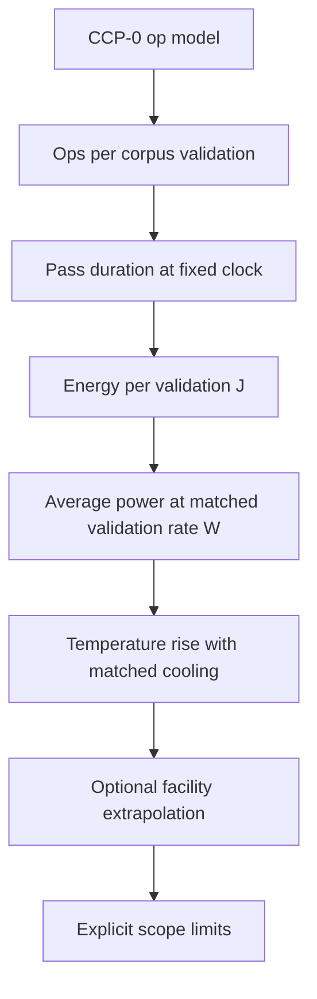

# Publishable thermal claim chain — P30 vs Hamming

This document defines what we **can** publish from the dual-FPGA bench when protocol **Mode RATE** is followed. It connects the Infoton demo op model to lab measurements without over-claiming rack-scale impact.

## Claim chain (intended publication logic)



| Step | Claim | Evidence | Status |
|------|--------|----------|--------|
| **1** | P30 Library uses **489** irreversible ops per 163-char validation; Hamming uses **12 264** | Demo, `p30_core`, conformance CI | **Proven (software)** |
| **2** | Soak firmware reproduces those op counts per pass | `p30_soak.c`, `hamming_soak.c`, `soak_core.py` | **Proven (emulation)** |
| **3** | At fixed FPGA clock, Hamming pass duration **T_H / T_P ≈ 12 264 / 489 ≈ 25.1** | Timer on `PASS` response or logic analyzer | **Target (hardware)** |
| **4** | Energy per validation **E = ∫ P(t) dt** over one pass; **E_H / E_P ≈ T_H / T_P** if dynamic power dominates | INA260 sampled around `PASS` | **Target (hardware)** |
| **5** | At **matched validation rate** (e.g. 1 Hz), **⟨P⟩_H / ⟨P⟩_P ≈ E_H / E_P** | Mode **RATE** / host `PASS` pacing | **Target (hardware + emulation)** |
| **6** | With identical airflow, steady **ΔT** tracks **⟨P⟩** (secondary: XADC / thermocouple) | Soak + swap A/B | **Target (hardware)** |
| **7** | Rack kW / water cooling **not** inferred from two Arty boards alone | — | **Out of scope** |

## Two bench modes

| Mode | Command | Use | Publishable for |
|------|---------|-----|-----------------|
| **MAX** | `START LIBRARY` / `START` | Max throughput; pass-rate ratio | Steps 1–2; **not** lower °C at pegged utilization |
| **RATE** | Host `PASS` at fixed Hz (recommended **1 Hz**) | Matched validations/sec | Steps 3–6 |

### Mode RATE (publishable path)

Host sends **`PASS`** to both boards at the same wall-clock instants (e.g. every 1.000 s):

```
OK PASS ops=489
OK PASS ops=12264
```

Log INA260 power over each 1 s window. Compute:

- **E_P** = ∫ P_P30 dt over window  
- **E_H** = ∫ P_Hamming dt over window  
- **J/validation** = E per pass (one pass per window)  
- **⟨P⟩** at 1 Hz = mean(E) over many windows  

**Primary publishable metric (step 4):** **work energy** E_work = integral of (P − P_idle) over pass, or ACTIVE × t_pass when dynamic power dominates. Compare E_work_H / E_work_P ≈ **25.1** at matched validation rate.

**Secondary (step 5):** total window energy / ⟨P⟩ at 1 Hz includes idle baseline — report both; hardware INA260 measures total.

**Secondary:** thermocouple or Xilinx XADC **ΔT above ambient** after soak equilibrium.

## Acceptance criteria (hardware paper / tech report)

Report all of:

1. **Op parity** — 489 / 12 264 ops per pass (UART `OK PASS ops=…`)  
2. **Matched rate** — ≥3600 paired `PASS` cycles (≥1 h at 1 Hz) after 30 min burn-in  
3. **Swap A/B** — full protocol repeated with boards exchanged  
4. **Energy ratio** — E_H / E_P with 95% CI; compare to op ratio 25.1 (Library)  
5. **Power ratio** — ⟨P⟩_H / ⟨P⟩_P at same validation rate  
6. **Temperature** — optional ΔT with identical fan jig  
7. **Limits** — one paragraph: dev boards ≠ rack; see [`viz/impact.html`](../../viz/impact.html) as hypothesis not measured here  

## Tooling

| Tool | Mode |
|------|------|
| [`tools/soak_emulate.py`](../../tools/soak_emulate.py) | `--mode rate --rate 1` |
| [`tools/bench_dual_fpga.py`](../../tools/bench_dual_fpga.py) | `--mode rate --rate 1` |
| [`tools/thermal_report.py`](../../tools/thermal_report.py) | CSV → summary markdown |

## Emulation (pre-hardware)

```bash
python tools/soak_emulate.py --mode rate --rate 1 --duration 10
python tools/thermal_report.py benches/thermal/emulate_*.csv
```

Emulation uses pass-duration ∝ ops to estimate **E_H / E_P ≈ 25.1** at matched rate.

## Related

- [dual-fpga-thermal.md](dual-fpga-thermal.md) — BOM and protocol  
- [ROADMAP](../ROADMAP.md) — Phase 9  
- [P30-SPEC](../P30-SPEC.md) — CCP-0 profiles  
